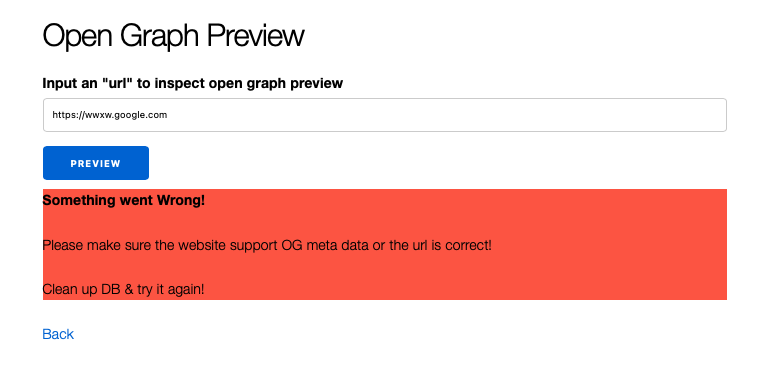

# Open Graph preview

To start your Phoenix server:

* Install dependencies with `mix deps.get`
* Create and migrate your database with `mix ecto.setup`
* Start Phoenix endpoint with `mix phx.server` or inside IEx with `iex -S mix phx.server`

Now you can visit [`localhost:4000`](http://localhost:4000) from your browser.

Ready to run in production? Please [check our deployment guides](https://hexdocs.pm/phoenix/deployment.html).

## To test

Go to page [`http://localhost:4000/open_graphs`](http://localhost:4000/open_graphs), the landing page will be as below
      

1) input a test website (eg: <https://www.getluna.com/>), which has been processed before (seed data in local DB), all meta data related to this website's can be shown, with `image` being shown as an image.

    

2) input another test website, a new task will be created to parsing the meta data and update its information to DB once parsing is done. UI will display the following without waiting for task to complete.

    

3) when the data is processed, the 2nd time the user query the same url (eg: <https://wwww.google.com> ), the correct preview page will be rendered.

    

4) when the 'url' doesn't have the correct og metadata, and cannot be parser correctly, error information should be displayed, eg:  
   

NOTE: The UI won't change automatically when DB is updated. A User can manually refresh the page to get the updated preview.

* the async task can be quickly within 1 or two seconds
* Before the task is done, there won't be mutliple tasks created. New tasks can only be created when in "pending" status (not in other status)
* it can be done with js/react to query refresh the page if needed.
* or use pub/sub method
*

## TODOS

* unit tests

* code clean-up
